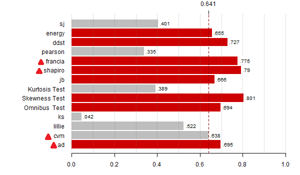

## Cel pracy 

  Celem pracy jest analiza mieszkań zebranych w pliku **mieszkania.xls**, doprowadzenie zestawu danych do rozkładu normalnego, przeprowadzenie analizy ANOVA, przeprowadzenie analizy post-hoc, wyznaczenie efektów eksperymentalnych. Głównym pytaniem badawczym jest, w jakim stopniu wpływają odpowiednie zmienne jakościowe na zmienną objaśnianą dla wybranego zbioru danych.
  
### Określenie testów statystycznych używanych w projekcie
  
Do przeprowadzenia analizy ANOVA, niezbędnym jest sprawdzenie normalności rozkładu zbioru zmiennych.
Istnieje dużo testów normalności, które się różnią sposobami konstrukcji statystyk testowych. Podczas projektu używane będą pięću testów, pasujących dla rozpatrywanego problemu.

  * Test Shapiro-Wilka
  * Test Shapiro-Francia
  * Test Andersona-Darlinga
  * Test Cramera von Misesa
  
  Dla wszystkich wyżej wymienionych testów Hipotezą zerową jest należenie zbioru do rozkładu normalnego, założenie Hipotezy alternatywnej natomiast jest odwrotne do H0.

  * Test Grubbsa
  
  Test Grubbsa ma inną cel wykorzystania -> wskazuje na występujące outliery. 
  
  &ensp;&ensp;&ensp;H0 -> Outliery nie występują
  
  &ensp;&ensp;&ensp;H1 -> Outliery występują 

  Niżej przedstawiono moc najczęściej stosowanych testów, trójkątami oznaczone są testy stosowane w projekcie. Można zauważyć, że moc każdego z wybranych testów jest na poziomie wystarczającym ( >0.6).



### Wstępna analzia danych
  
Wczytam dane i zainstaluję biblioteki, które będą używane podczas projektu.

```{r include=FALSE}
library(readxl)
library(dplyr)
library(psych)
library(stats)
library(nortest)
library(outliers)
library(sjstats)
library(multcompView)
library(moments)
```
```{r include=FALSE}
mieszkania <- read_excel("C:\\Users\\Uladzslau\\Documents\\anovaPL\\mieszkania.xls")
```

Widać, że żadną zmienną w tym zestawie można przyjąć jako zmienną objaśnianą. Podjęto decyzję o stworzeniu nowej zmiennej,
która będzie wyjaśniała cenę za metr kwadratowy powierzchni dla każdego mieszkania. 

```{r include=FALSE}
mieszkania1 <- mutate(mieszkania,cenaZaMetrKw = mieszkania$cena / mieszkania$powierzchnia)
head(mieszkania1)
```

  Dalej przeprowadzono testy normalności dla otrzymanego zbioru. Zmienną objaśnianą jest nowo utworzona "**cenaZaMetrKw**"

```{r include=FALSE}
shapiro.test(mieszkania1$cenaZaMetrKw)

sf.test(mieszkania1$cenaZaMetrKw)

ad.test(mieszkania1$cenaZaMetrKw)

cvm.test(mieszkania1$cenaZaMetrKw)

grubbs.test(mieszkania1$cenaZaMetrKw)
```
|       Test       | Wartość p-value   |
|:----------------:|:-----------------:|
|   Shapiro-Wilk   |  p = 1.122e-11    |
| Shapiro-Francia  |  p = 3.365e-10    |
| Anderson-Darling |  p < 2.2e-16      |
| Cramer-von Mises |  p = 7.371e-10    |
|     Grubbs       |  p = 0.03313      |

Rezultaty testów normalności są przykre, żadny z wybranych testów nie wskazał na normalnośc rozkładu. 
Dodatkowo test Grubbsa wykazał outliery występujące w zbiorze. 

```{r echo=FALSE, fig.height=5, fig.width=11}
par(mfrow = c(1,2))
plot(mieszkania1$pokoi, mieszkania1$cenaZaMetrKw, xlab = "Pokoi", ylab = "Cena za metr")
boxplot(split(mieszkania1$cenaZaMetrKw, mieszkania1$pokoi), xlab = "Pokoi", ylab = "Cena za metr", col = c("Red", "Green", "Green", "Red"))
```

#### Czyszczenie danych

Dokonano decyzji pozbyć się części danych, liczba pokoi w których wynosi 1, z powodu wysokiego rosproszenia ceny za metr kwadratowy.

```{r include=FALSE}
mieszkania1 <- filter(mieszkania1, pokoi > 1)
```

Ponownie sprawdzamy normalnośc rozkładu:

```{r include=FALSE}
shapiro.test(mieszkania1$cenaZaMetrKw)

sf.test(mieszkania1$cenaZaMetrKw)

ad.test(mieszkania1$cenaZaMetrKw)

cvm.test(mieszkania1$cenaZaMetrKw)

grubbs.test(mieszkania1$cenaZaMetrKw)
```
|       Test       | Wartość p-value   |
|:----------------:|:-----------------:|
|   Shapiro-Wilk   |  p = 9.846e-05    |
| Shapiro-Francia  |  p = 0.0003826    |
| Anderson-Darling |  p = 1.346e-05    |
| Cramer-von Mises |  p = 4.093e-05    |
|     Grubbs       |  p = 0.8866       |

```{r echo=FALSE, fig.height=5, fig.width=11}
par(mfrow = c(1,2))
plot(mieszkania1$pokoi, mieszkania1$cenaZaMetrKw, xlab = "Pokoi", ylab = "Cena za metr")
boxplot(split(mieszkania1$cenaZaMetrKw, mieszkania1$pokoi), xlab = "Pokoi", ylab = "Cena za metr", col = c("Green", "Green", "Red"))
```


To działanie polepszyło wyniki, ale wciąż tego jest niewystarczająco, usuniemy dane z liczbą pokoi równą 4 oraz outlier dla liczby pokoi = 3, który można widzieć na wykresie pudełkowym.

```{r echo=FALSE}
mieszkania1 <- filter(mieszkania1, pokoi < 4)
mieszkania1 <- filter(mieszkania1, cenaZaMetrKw < 5200)
```

Ponownie przeprowadzono testy normalności:

```{r include=FALSE}
shapiro.test(mieszkania1$cenaZaMetrKw)

sf.test(mieszkania1$cenaZaMetrKw)

ad.test(mieszkania1$cenaZaMetrKw)

cvm.test(mieszkania1$cenaZaMetrKw)

grubbs.test(mieszkania1$cenaZaMetrKw)
```
|       Test       | Wartość p-value   |
|:----------------:|:-----------------:|
|   Shapiro-Wilk   |  p = 0.01537      |
| Shapiro-Francia  |  p = 0.04078      |
| Anderson-Darling |  p = 0.03533      |
| Cramer-von Mises |  p = 0.0713       |
|     Grubbs       |  p = 1            |

```{r echo=FALSE, fig.height=5, fig.width=11}
par(mfrow = c(1,2))
plot(mieszkania1$pokoi, mieszkania1$cenaZaMetrKw, xlab = "Pokoi", ylab = "Cena za metr")
boxplot(split(mieszkania1$cenaZaMetrKw, mieszkania1$pokoi), xlab = "Pokoi", ylab = "Cena za metr", col = c("Green", "Green"))
```


Jak widać wartości p-value dla każdego z testów normalności są bardzo blizkie 5%. Dla dalszych badań przyjęto alfa = 0.01.
Przeprowadzono analizę statystyczną dla tych danych:
```{r include=FALSE}
describe(mieszkania1, na.rm = FALSE, interp = FALSE, skew=TRUE, ranges=FALSE, type=3)
```

* Pożądane jest, aby dla normalnego rozkładu danych wartości skośności były bliskie 0,
w tym przypadku wartości skośności znajdują się w przedziale od -0.5 do 0.5, rozkład jest symetryczny.

* Dla kurtozy natkałem się na praktyczną zasadę, że wartości dla rozkładu normalnego mogą wynosić od -3,0 do 3,0
W naszym przypadku wszystkie wartości kurtozy sa w przedziale od -2 do 0. Znaczy to, że rozkłady są spłaszczone, a wartości cech nie skoncentrowane.

#### Normalność rozkładu

```{r}
attach(mieszkania1)
y <- cenaZaMetrKw
x1 <- cena
x2 <- pokoi
x3 <- powierzchnia
x4 <- dzielnica
x5 <- mieszkania1$'typ budynku'
```

Analizując otrzymane wartości skośności i kurtozy, oraz przyjmując alfę na poziomie 0.01 (1%), podjęto decyzję o kontynuwaniu  pracy z otrzymanym zbiorem danych, przyjmując jego rozkład jako normalny. Potwierdzeniem tego są wykresy przedstawione niżej:

```{r echo=FALSE, fig.height=4, fig.width=9}
x <- seq(-5,5,0.1)
par(mfrow = c(1,2))
plot(density(y, bw=200), main = "Wykres gęstości zm 'y'", ylab = "", xlab = "zł/m^2")
plot(x, dnorm(x), type="l", cex.axis=1.5, cex.lab=1.5, main = "Przykład wykresu gęstości dla rozkł. norm.", ylab = "")
```

Pierwszym wykresem jest wykres gęstości zmiennej objaśnianej (**cenaZaMetrKw**), a po prawej stronie od niego przykład wykresu gęstości dla rozkładu normalnego.

### ANOVA

#### Test Bartletta 

Niezbędnymi założeniami analizy dwuczynnikowej wariancji jest normalność próby, oraz normalność i jednorodność wariancji w podgrupach wyznaczonych. Jednorodność wariancji sprawdzono przy pomocy testu Bartletta dla jednorodności wariancji z zestawem hipotez:

  * H0: σ^21= σ^22 = .... = σ^2k
  * H1: nie wszystkie σ^2 są jednakowe
  
```{r include=FALSE}
bartlett.test(y~x4)
bartlett.test(y~x5)
bartlett.test(y~interaction(x4,x5))
```

|   Bartlett       | Wartość p-value   |
|:----------------:|:-----------------:|
|   Dzielnica      |  p = 0.6114       |
| Typ budynku      |  p = 0.1673       |
| Interakcja dzielnica:typ    |  p = 0.4771       |

Jak widać wartości p-value dla obydwóch zmiennych, oraz dla ich interakcji są znacznie wyżej 0.01. Przyjęto jednorodność wariancji.

#### Test Shapiro

Normalność rozkładu w podgrupach obliczymy przy pomocy testu Shapiro dla podgrup wyznaczonych

```{r include=FALSE}
tapply(y,x4,shapiro.test)
tapply(y,x5,shapiro.test)
```

|     Podgrupa         | Wartość p-value   |  
|:--------------------:|:-----------------:|
| Biskupin             |  p = 0.1473       |
| Krzyki               |  p = 0.208        |
| Śródmieście          |  p = 0.1199       |
|----------------------|-------------------|
| Kamienica            |  p = 0.08235      |
| Niski blok           |  p = 0.431        |
| Wiezowiec            |  p = 0.5224       |

***

Rozkład jest normalny w każdej z wyznaczonych podgrup, bo wartość p-value dla każdej z nich jest powyżej 5%.

#### Sprawdzanie zachodzenia iterakcji

Dalej warto w sposób graficzny sprawdzić,czy w modelu powinny zostać uzwgliędnione interakcje między czynnikami.
```{r echo=FALSE, fig.height=4, fig.width=10}
par(mfrow=c(1,2))
interaction.plot(x4,x5,y, ylim = c(3200,4800), trace.label = "Typ budynku", xlab = "Dzielnica", ylab = "Średnia Cena/Mkw")
interaction.plot(x5,x4,y, ylim = c(3200,4800), trace.label = "Dzielnica", xlab = "Typ budynku", ylab = "Średnia Cena/Mkw")
```
Z wykresów widać, że dla zmiennej "Typ budynku" interakcje nie zachodzą, czego nie można powiedzieć dla zmiennej "Dzielnica". Dodatkowo na tym etapie pracy można stwierdzić, że każdy z czynników ma wpływ na cenę za metr kwadratowy powierzchni, chociaż w raznym stopniu. Analiza wariancji będzie wykonana przy uwzględnieniu interakcji.

#### Analiza wariancji

```{r include=FALSE}
m1<-aov(y~x4*x5)
```

|       Zmienna        | Wartość p-value   |  Wartość  F-value  |
|:--------------------:|:-----------------:|:------------------:|
| Dzielnica            |  p = 0.009582**   |   F = 4.8755       |
| Typ budynku          |  p = 0.452309     |   F = 0.7998       |
| Dzielnica:Typ budynku|  p = 0.891848     |   F = 0.2776       |

Na podstawie uzyskanych wartości statystyki F oraz odpowiadających im wartości prawdopobieństwa testowego można stwierdzić, że wyłącznie dzielnica ma wpływ na zmienną objaśnianą, będzie ona analizowana dalej w ciągu projektu. Co można powiedzieć o typu budynku oraz interakcji między czynnikami? Wartość p-value jest zawysoka dla odrzucenia Hipotezy zerowej z tego faktu można stwierdzić, że nie mają oni wpływu na cenę za metr kwadratowy.

Sama analiza wariancji mówi nam o tym czy różnice w porównywanych średnich występują czy nie. Nie wiemy jednak między którymi grupami zachodzą te różnice.  Jeśli odrzucamy Hipotezę zerową musimy dowiedzieć się czy wszystkie średnie różnią się między sobą czy tylko niektóre. Dla tego stosujemy testy post-hoc. 

#### Post hoc

Do analizy post-hoc będziemy wykorzystali Test Tuckey'a, jeden z najpopularniejszych i najberdziej polecanych testów do porównywania par śriednich. Wykorzystane dalej wykresy można opisać w ten sposób: im dalej od środka jest odcinek, tym bardziej istotna jest rozpatrywana para czynników
```{r include=FALSE}
tk<-TukeyHSD(m1)
tk
```


  * Pierwszy wykres: Przeprowadzony test post-hoc pozwala stwierdzić, że między dzielnicami Krzyki oraz Biskupin zachodzi istotna różnica w cenie. Ta różnica jest mniej istotna dla dzielnic Śródmieście-Krzyki, oraz wogóle niestotna dla Śródmieście-Biskupin.
  
  * Drugi oraz trzeci wykresy pozwalają upewnić się w tym, że ani typ budynku, ani interakcja dzielnicy i typu budynku nie istotnie wpływa na cenę.

```{r echo=FALSE, fig.width=10}
par(mfrow = c(1,3))
plot(tk)
```

#### Efekty eksperymentalne  

Wielkość efektu eksperymentalnego to wartość, która pozwala zobaczyć, jak bardzo zmienna niezależna wpływa na zmienną zależną. Do tego są używane wskaźniki η^2 oraz ω^2.

Zanim obliczać wielkości efektu, zapoznamy się z wytycznymi Cohena. Według niego:

  * Słaby efekt: 0 - 0.059
  * Średni efekt: 0.06 - 0.138
  * Silny efekt: 0.139 - 1
  
Wskaźnik η^2 definiujemy jako proporcję wariancji błędu i efektu wyjaśnionej przez efekt eksperymentalny.
```{r include=FALSE}
eta <- eta_sq(m1)
```

```{r echo=FALSE}
print(eta)
```


Opierając się na wyniki, można z pewnością mówić o słabości efektu zmiennej "x5"(Typ budynku) oraz interakcji zmienncyh "x4"(Dzielnica) i "x5". Natomiast efekt wpływu samej zmiennej "x4" na cenę jest średni, umiarkowany.

***

Współczynnik ω2 jest estymatorem wariancji zmiennej zależnej wyjaśnionej przez zmienną niezależną w całej populacji. 
```{r include=FALSE}
omega <- omega_sq(m1)
```

```{r echo=FALSE}
print(omega)
```

Wyniki są bardzo podobne, znowu średni efekt ma zmienna "x4", kiedy "x5" oraz interakcja zmiennych x4:x5 wpływają słabo.

### Podsumowanie

Celem pracy było ocenianie wpływu zmiennych jakościowych na zmienną objaśnianą. Po analize wariancji przy uwzględnieniu interakcji zostały widoczne niektóre detale, było zdecyzowano wykonanie dodatkowej metody takiej jak post-hoc. Zaczęły pojawiać się pewne zależności, na przykład: wpływ  zmiennej x5 jest średnio mocniejszy od interakcji zmiennych x4:x5 oraz słabszy od x4. Po wykonaniu ostatniej metody i sprawdzeniu efektów eksperymentalnych, odpadły wszystkie pytania, otrzymaliśmy porządny ranking mocy efektów dla wszystkich badanych zmiennych. Można podsumować, że cena z metr kwadratowy w mieszkaniu bardzo słabo w bardzo słąbym (bliskim zeru) stopniu zależy od typu budynku oraz interakcji zmiennych typ:dzielnica. Jednak można mowić o wystarczającym poziomie efektywności w tym pytaniu dzielnicy, w której te mieszkanie się znajduję.  
